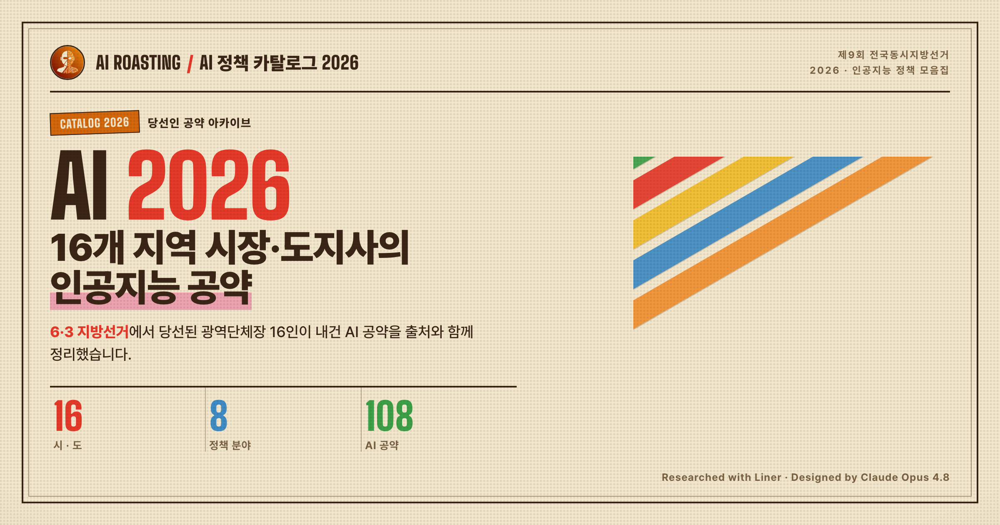

# AI 정책 카탈로그 2026

**v1.0.0 · 2026-06-07**

**라이브 웹사이트: https://airoasting.github.io/aipolicy2026/**

2026년 6·3 제9회 전국동시지방선거에서 당선된 **16개 시·도지사**의 AI 공약 **108건**을 출처·신뢰도와 함께 한곳에 정리한 웹사이트입니다. 단일 HTML 파일(`index.html`)과 데이터 파일(`data.js`)만으로 동작합니다.



## 무엇이 들어있나

- **Executive Summary(요약)**: 108개 공약의 쏠림과 빈칸을 카드 4개로 진단합니다(투자 경쟁 쏠림, 비어 있는 자리, 규모는 키웠지만 관건은 실행 등).
- **한눈에 보기(비교 격자)**: 16개 시·도와 8개 분야의 분포를 매트릭스로 보여 줍니다. 색이 진할수록 공약 수가 많고, 왼쪽에서 오른쪽으로 갈수록 쏠림이 드러납니다.
- **건수 지도**: 지역별 공약 수를 대한민국 지도와 순위 리스트로 보여 줍니다. 색은 정당을 기준으로 합니다(민주당 파랑, 국민의힘 빨강).
- **지역별·카테고리별 카드**: 당선자 사진과 주요 경력, **득표율**, AI 정책 담당 조직(확인·추정·미발표), 정책 카드(분야, 정량 수치, 신뢰도 배지, **팩트체크 배지**, 출처 링크)를 담았습니다. 본문은 불릿으로 정리했습니다.
- 그 밖에 **우측 하단 ‘요약’ 위치 인디케이터**(요약·한눈에 보기 구간에서 현재 위치를 표시), 검색, 지역·카테고리 보기 전환, 모바일 최적화를 지원합니다.

## 데이터

- `data.js`의 `window.AI_DATA`에 16개 지역과 정책 108건이 들어 있습니다. 멀티 에이전트 파이프라인(지역 리서치 후 적대적 팩트 검증)으로 수집하고 검증했습니다.
- **득표율**은 당선인 16명 전원을 중앙선거관리위원회 공식 확정치로 전수 검증했습니다.
- 각 정책의 `factcheck`는 세 가지를 기록합니다. `url_live`(링크 생존), `cross_verified`(복수 매체 교차), `redteam_survived`(반증 시도 생존)입니다.
- 신뢰도 태그는 직접인용, 보도확인, 단일출처, 확인안됨, 예비후보기로 나뉩니다.
- AI 담당 인물과 조직은 취임 전이라 상당수가 ‘미발표’ 또는 ‘추정’입니다. 지어내지 않고 있는 그대로 표기했습니다.

## 변경 이력

### v1.0.0 (2026-06-07)

- 당선인 16명의 사진을 `.webp`로 교체하고, 경력과 임기를 정리했습니다(국회의원·도지사 종료 연도 보정, ‘민선 N기’ 표기 제거).
- 당선 문구를 `{직위} 당선(득표율%)`으로 통일하고, 득표율을 전원 선관위 공식 확정치로 검증했습니다.
- 정책 카드 본문을 모두 불릿(•)으로 통일하고(나열형 항목 분리, 인용문 보존), 가로로 놓인 카드 2개의 높이를 맞췄으며, 제목 폰트를 Pretendard로 바꿨습니다.
- Executive Summary 요약 문구와 카드 hover 애니메이션을 다듬고, 한눈에 보기 매트릭스와 건수 지도를 추가했습니다.
- 우측 하단에 ‘요약’ 버튼을 고정하고, 마스트헤드 부제목을 가운데로 정렬했으며, 로고 글자 웨이브와 소셜 아이콘 간격을 정리했습니다.

## 면책 고지

- **정치적 중립**: 특정 정당이나 후보를 지지하거나 반대하지 않습니다. 타일과 배지의 정당색은 소속을 나타내는 표시일 뿐입니다.
- **데이터 시점**: 공약은 후보와 당선인의 발표 및 보도 시점을 기준으로 합니다. 취임(2026.07) 이후 공식 시정 계획에서 달라질 수 있습니다.
- **AI 생성·검증의 한계**: 자료 수집과 팩트체크, 작성에 AI를 사용했습니다. 검증을 거쳤지만 오류가 남아 있을 수 있으며, ‘단일출처’ 항목은 교차검증을 거치지 않았습니다. 중요한 사실은 각 정책의 출처 링크에서 직접 확인해 주시기 바랍니다.
- **출처와 저작권**: 당선인 사진은 Wikimedia Commons의 실사를 레트로 듀오톤으로 가공한 것입니다. 인용한 내용의 출처는 각 카드의 링크에 밝혀 두었습니다.
- **비영리·비상업**: 정보 제공을 목적으로 하는 비상업 프로젝트입니다.
- **정정 요청**: 오류나 누락을 발견하시면 제작자에게 알려 주시기 바랍니다. 확인한 뒤 반영하겠습니다.

## 라이선스

이 프로젝트는 Apache License 2.0에 따라 배포됩니다. 전체 조항은 같은 폴더의 [`LICENSE`](LICENSE) 파일에서 확인하실 수 있습니다.

```
Copyright 2026 AI ROASTING

Licensed under the Apache License, Version 2.0 (the "License");
you may not use this file except in compliance with the License.
You may obtain a copy of the License at

    http://www.apache.org/licenses/LICENSE-2.0

Unless required by applicable law or agreed to in writing, software
distributed under the License is distributed on an "AS IS" BASIS,
WITHOUT WARRANTIES OR CONDITIONS OF ANY KIND, either express or implied.
See the License for the specific language governing permissions and
limitations under the License.
```
